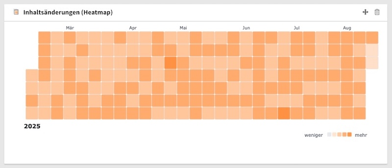
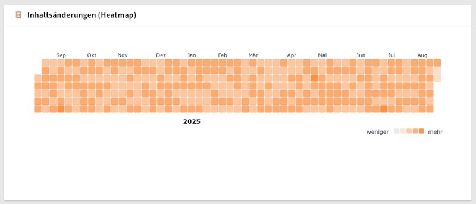
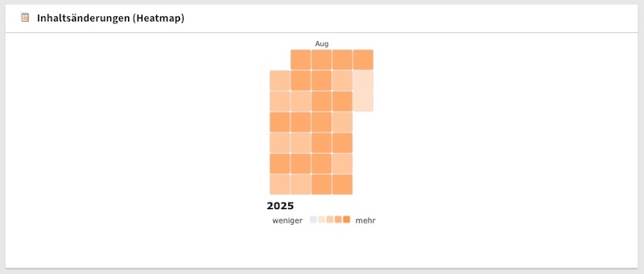
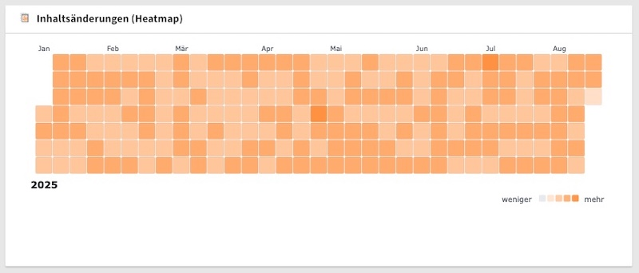

# Custom Data Providers

Create a custom data providers for the Heatmap Widget to visualize your own data sources.

> [!tip]
> The heatmap widget can e.g. be used to visualize visitor analytics like [Matomo](https://matomo.org/) page views or any other data source that provides date-based counts.

- [Data Format](#data-format)
- [Implementation](#implementation)
  - [Data Provider Class](#data-provider-class)
  - [Services Configuration](#services-configuration)
  - [Date Range Modes](#date-range-modes)
- [Summary](#summary)

## Data Format

```php
[
    [
        'date' => '2025-01-15',    // YYYY-MM-DD format
        'count' => 23,             // Integer value
        'link' => 'https://...'    // Optional: clickable URL
    ],
    // ...
]
```

| Field | Type | Required | Description |
|-------|------|----------|-------------|
| `date` | `string` | ✅ | Date in YYYY-MM-DD format |
| `count` | `int` | ✅ | Non-negative integer value |
| `link` | `string` | ❌ | Optional URL for clickable cells |

## Implementation

### Data Provider Class

```php
<?php
namespace YourVendor\YourExtension\Widgets\Provider;

use TYPO3\CMS\Dashboard\Widgets\ListDataProviderInterface;

class CustomDataProvider implements ListDataProviderInterface
{
    public function getItems(): array
    {
        // Your data fetching logic
        return [
            ['date' => '2025-01-15', 'count' => 23, 'link' => 'https://...'],
            // ...
        ];
    }
}
```

### Services Configuration

```yaml
services:
  custom-heatmap-widget:
    class: 'KonradMichalik\Typo3HeatmapWidget\Widgets\Heatmap'
    arguments:
      $dataProvider: '@YourVendor\YourExtension\Widgets\Provider\CustomDataProvider'
      $options:
        color: '46, 125, 50'           # Custom green color
        dateRangeMode: 'auto'          # auto, year, year-auto, month
        showLegend: true
        showYearLabels: true
        showMonthLabels: true
        weekStartsOnMonday: false      # Sunday week start (GitHub style)
    tags:
      - name: dashboard.widget
        identifier: 'custom-heatmap'
        title: 'Custom Data Heatmap'
        iconIdentifier: 'heatmap-widget-custom'
        height: 'medium'
        width: 'medium'
```

> [!note]
> The widget is fairly responsive, but not all sizes are compatible with the heat map display.

### Date Range Modes

The following render date range modes are available:

1. `auto` (default)



- Automatically calculates optimal date range based on container size and available data
- Shows minimum 30 days, maximum 365 days
- Prioritizes space utilization for best visual representation
- May trim older data if it exceeds optimal display duration

2. `year`



- Fixed 365-day period ending today
- Always shows exactly one year of data
- Consistent time window regardless of data availability

3. `month`



- Fixed 30-day period ending today
- Shows last month of activity
- Ideal for recent activity monitoring

4. `year-auto`



- Shows current calendar year based on available data
- Starts from January 1st or earliest data (whichever is later)
- Ensures minimum 30 days for meaningful visualization
- Adapts to available data within the current year

---

## Summary

1. Implement `ListDataProviderInterface` with `getItems()` method
2. Return array with `date`, `count`, and optional `link` fields
3. Register provider and configure widget options in `Services.yaml`

The base `Heatmap` class handles all visualization automatically - so no custom widget class needed.