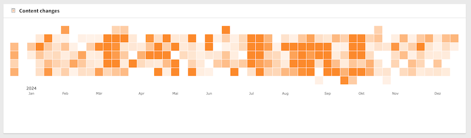

<div align="center">


# TYPO3 extension `typo3_heatmap_widget`

[](https://extensions.typo3.org/extension/typo3_heatmap_widget)

</div>

This extension provides a dashboard widget to display a heatmap of e.g. TYPO3 content changes.

## Installation

### Composer

In a composer-based TYPO3 installation you can install the extension EXT:xima-typo3-recent-updates via composer:

``` bash
composer require KonradMichalik/typo3-heatmap-widget
```

### TER

ToDo

## Usage



## Configuration

ToDo

## License

This project is licensed
under [GNU General Public License 2.0 (or later)](LICENSE.md).