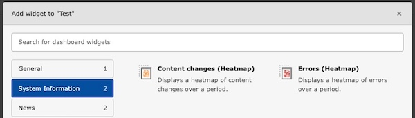

<div align="center">


# TYPO3 extension `typo3_heatmap`

[](https://extensions.typo3.org/extension/typo3_heatmap)
[](https://extensions.typo3.org/extension/typo3_heatmap)
[](https://packagist.org/packages/konradmichalik/typo3-heatmap)

[](https://coveralls.io/github/jackd248/typo3-heatmap)
[](https://github.com/jackd248/typo3-heatmap/actions/workflows/cgl.yml)
[](https://github.com/jackd248/typo3-heatmap/actions/workflows/tests.yml)
[](LICENSE.md)

</div>

This extension provides a dashboard widget to display a (GitHub lookalike) contribution heatmap of e.g. for TYPO3 content changes.

> [!warning]
> This package is in early development stage and may change significantly in the future. Use it at your own risk.


## ✨ Features
*  **Dashboard heatmap for content changes:** Instantly visualize when and how much content was changed in TYPO3.
*  **Dashboard heatmap for system errors:** Quickly identify critical periods and error spikes with a clear heatmap overview.
*  **Dashboard heatmap for user logins:** Track user activity and login patterns over time with a visual heatmap.
*  **Custom heatmap widgets:** Flexibly extend your dashboard with your own widgets, e\.g\. for visitor analytics or other data sources.

## 🔥 Installation

### Requirements

* TYPO3 >= 12.4
* PHP 8.2+

### Composer

[](https://packagist.org/packages/konradmichalik/typo3-heatmap)
[](https://packagist.org/packages/konradmichalik/typo3-heatmap)

``` bash
composer require konradmichalik/typo3-heatmap
```

### TER

[](https://extensions.typo3.org/extension/typo3_heatmap)
[](https://extensions.typo3.org/extension/typo3_heatmap)

Download the zip file from [TYPO3 extension repository (TER)](https://extensions.typo3.org/extension/typo3_heatmap).

## ⚡ Usage

1. Install the extension.
2. Add the "Content changes (Heatmap)" widget to your dashboard via the "System Information" tab.



3. Display the heatmap within your dashboard.


### Custom Heatmap Widgets

You can register your own heatmap widgets by implementing a [custom data provider](./Documentation/DataProviders.md).

## 🧑‍💻 Contributing

Please have a look at [`CONTRIBUTING.md`](CONTRIBUTING.md).

## 💎 Credits

The extension icon based on  the original
[`content`](https://typo3.github.io/TYPO3.Icons/icons/content/content.html) icon from TYPO3 core which is
originally licensed under [MIT License](https://github.com/TYPO3/TYPO3.Icons/blob/main/LICENSE).

Empty icon by Chattapat from <a href="https://thenounproject.com/browse/icons/term/empty/" target="_blank" title="Empty Icons">Noun Project</a> (CC BY 3.0)

## ⭐ License

This project is licensed
under [GNU General Public License 2.0 (or later)](LICENSE.md).